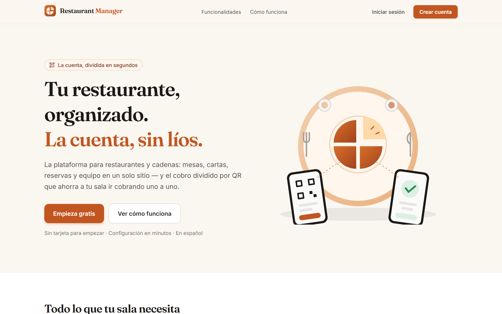
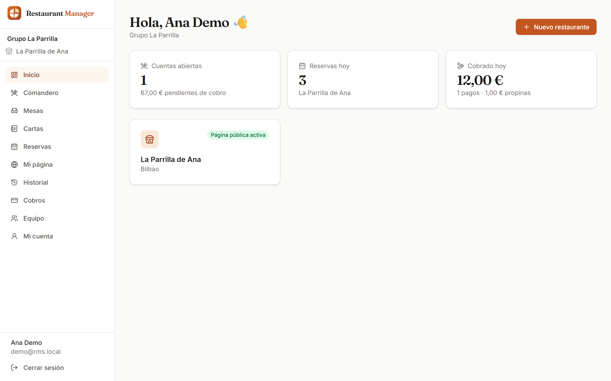
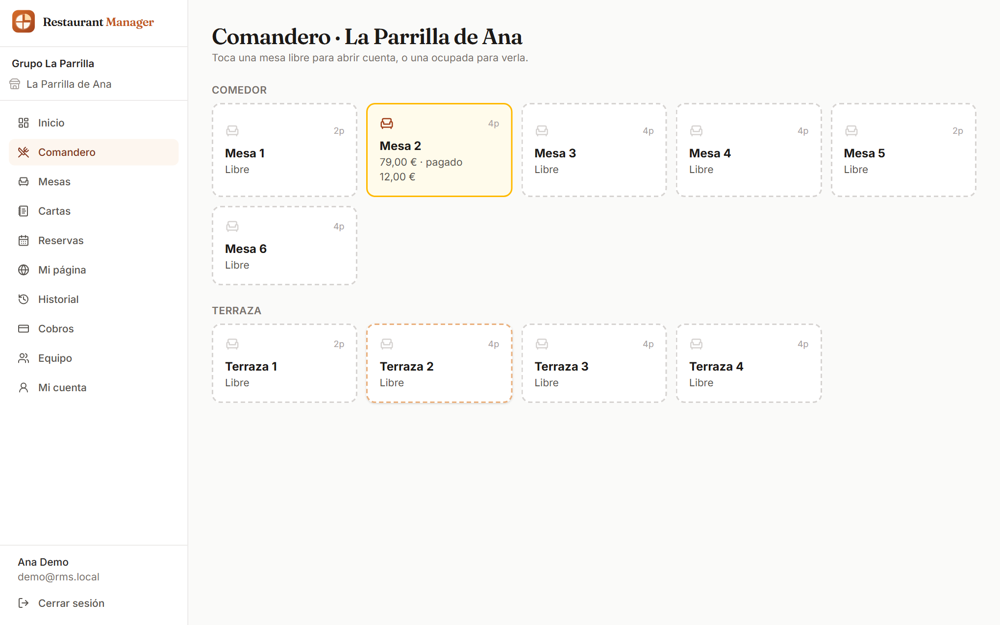
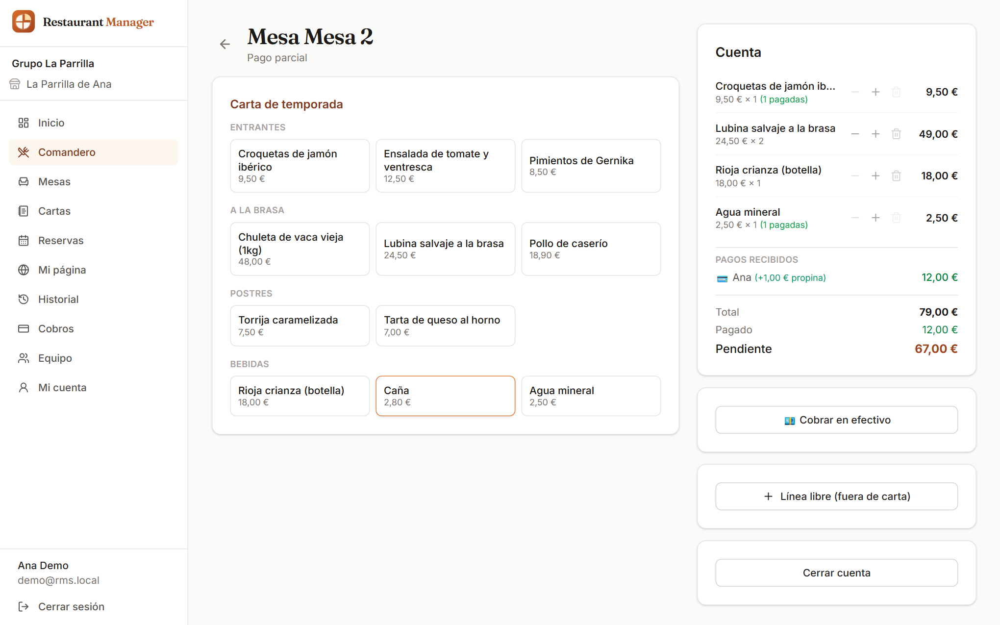
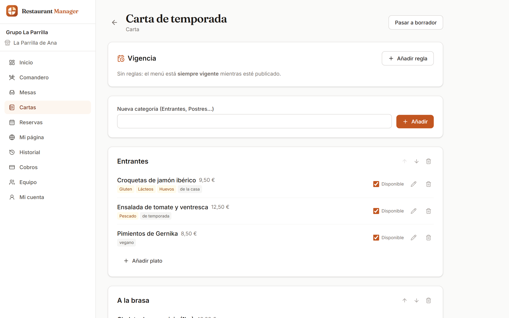
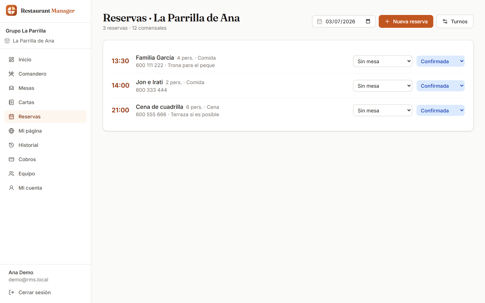
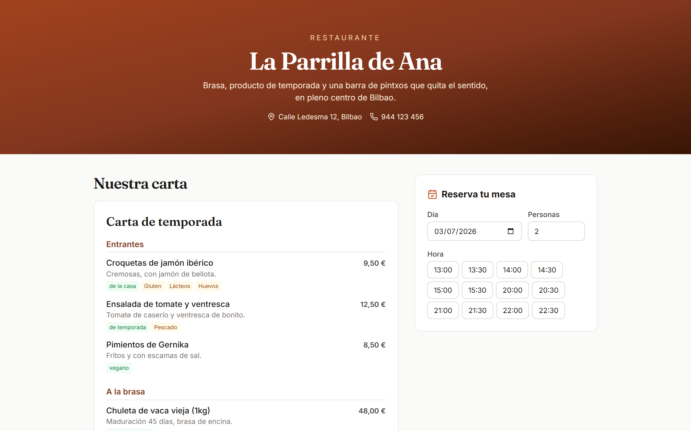
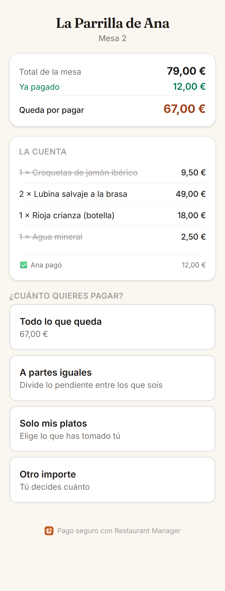

# Restaurant Manager

Plataforma de gestión para hostelería (restaurantes y cadenas) con **cobro dividido por QR en mesa**: cada comensal escanea el QR, ve la cuenta, elige qué paga (todo, a partes iguales, sus platos o un importe libre) y paga desde su móvil. El personal ve los pagos en tiempo real.

## Aplicaciones

| App | Qué es | URL en desarrollo |
| --- | --- | --- |
| `apps/api` | API REST (NestJS + Prisma + PostgreSQL) | http://localhost:4000 |
| `apps/web` | Backoffice de gestión + página pública de cada restaurante | http://localhost:3100 |
| `apps/pay` | App del comensal: QR → cuenta → dividir → pagar | http://localhost:3001 |
| `packages/shared` | Tipos, esquemas Zod y constantes compartidas | — |

## Puesta en marcha

Requisitos: Node.js ≥ 20, pnpm ≥ 9, Docker Desktop.

```bash
pnpm install
docker compose up -d            # PostgreSQL (localhost:5433) + Mailpit (UI: http://localhost:8025)
cp .env.example apps/api/.env   # ajustar si hace falta
pnpm db:migrate                 # migraciones Prisma
pnpm dev                        # api (4000) + web (3100) + pay (3001)
```

Primeros pasos: regístrate en http://localhost:3100/register (el email de verificación llega a Mailpit: http://localhost:8025), crea tu organización y tu primer restaurante, añade zonas y mesas, crea una carta y publícala.

### Cuenta demo

Para explorar el producto con datos realistas sin crear nada a mano:

```bash
node scripts/seed-demo.mjs
```

Crea el restaurante **La Parrilla de Ana** (carta, menú del día, mesas, reservas de hoy y una
cuenta a medio pagar por QR) y deja las credenciales listas:

- Backoffice: http://localhost:3100/login — `demo@rms.local` / `demo1234`
- Página pública: http://localhost:3100/r/la-parrilla-de-ana

## Capturas

| Portada | Panel del día |
| --- | --- |
|  |  |

| Comandero (plano de sala) | Cuenta de una mesa |
| --- | --- |
|  |  |

| Editor de carta | Reservas del día |
| --- | --- |
|  |  |

| Página pública del restaurante | El comensal divide y paga (móvil) |
| --- | --- |
|  |  |

Las capturas se regeneran con `node scripts/screenshots.mjs` (requiere la cuenta demo).

## Funcionalidades

**Plataforma de gestión**
- Cuentas con verificación por email y reseteo de contraseña (JWT + refresh rotativo en cookies httpOnly).
- Organizaciones/cadenas con roles `OWNER` / `ADMIN` / `MANAGER` / `STAFF` e invitaciones por email.
- Varios restaurantes por organización, con selector en el backoffice.
- Zonas y mesas con **QR imprimible** por mesa (hoja de tarjetas recortables).
- Cartas y menús: tipo carta o precio cerrado (menú del día), categorías, platos con precio, foto, **alérgenos UE-14**, etiquetas y disponibilidad; **vigencias temporales** (temporadas, días, franjas) resueltas en la zona horaria del restaurante; duplicado completo de menús.
- Reservas: turnos con aforo por franja de entrada, motor de disponibilidad, reservas del personal y públicas, confirmación y cancelación por email.
- Página pública `/r/[slug]` con la carta vigente y widget de reservas.

**Cobro dividido (SplitPay)**
- Comandero táctil: plano de mesas, cuenta por mesa con snapshot de precios, líneas libres.
- El comensal escanea el QR → ve la cuenta en vivo (SSE) → paga **todo / a partes iguales / sus platos / importe libre** + propina, sin instalar nada y sin registro.
- Reparto por ítems con reservas temporales (dos personas no pueden pagar el mismo plato).
- Protección contra dobles pagos simultáneos y validación de importes 100% en el servidor.
- Stripe Connect (Express): el dinero va directo a la cuenta del restaurante; tarjeta, Apple/Google Pay y Bizum vía Payment Element.
- Cobro mixto (QR + efectivo), recibos por email, historial con propinas y export CSV.
- **Modo demo**: sin claves de Stripe, el flujo completo funciona con un botón de confirmación simulada.

## Activar pagos reales (modo test de Stripe)

1. Crea una cuenta en [stripe.com](https://stripe.com) y copia las claves de **modo test**.
2. En `apps/api/.env`: `STRIPE_SECRET_KEY=sk_test_…` y `STRIPE_PUBLISHABLE_KEY=pk_test_…`.
3. Webhooks en local: instala [Stripe CLI](https://docs.stripe.com/stripe-cli) y ejecuta
   `stripe listen --forward-to localhost:4000/webhooks/stripe`; copia el `whsec_…` a `STRIPE_WEBHOOK_SECRET`.
4. Reinicia la API. En el backoffice → **Cobros** → “Configurar cobros con Stripe” (onboarding Express de prueba).
5. Paga con la tarjeta de test `4242 4242 4242 4242`. Bizum se puede activar en el Dashboard de Stripe (Payment methods).

## Comandos

```bash
pnpm dev          # los tres servidores en watch
pnpm build        # build de producción (turbo)
pnpm typecheck    # TypeScript en todos los paquetes
pnpm --filter @rms/api test:e2e   # 61 tests e2e (requiere docker compose up)
pnpm db:studio    # Prisma Studio
```

## Arquitectura

- **Una API modular** (NestJS): `auth`, `orgs`, `tables`, `menus`, `reservations`, `checks`, `payments` (Stripe), `split-pay` (comensal). Tenancy por organización con guards de rol.
- **Dinero siempre en céntimos** (enteros). Los pagos confirmados por **webhook de Stripe** son la única fuente de verdad del "pagado".
- **Tiempo real** por SSE (bus en memoria; para múltiples réplicas se sustituiría por Redis pub/sub).
- Emails con Nodemailer (Mailpit en desarrollo; apuntar `SMTP_*` a Resend/SES/etc. en producción).

## Despliegue (orientativo)

- `web` y `pay` → Vercel (`NEXT_PUBLIC_API_URL`, `NEXT_PUBLIC_PAY_URL`).
- `api` + PostgreSQL → Railway/Fly/Render (ejecutar `prisma migrate deploy` en el release).
- Configurar `WEB_URL`, `PAY_URL`, `API_PUBLIC_URL`, secretos JWT nuevos, SMTP real y claves de Stripe (con el webhook apuntando a `https://api…/webhooks/stripe`).
- Subida de fotos: en producción cambiar el almacenamiento local por S3/R2 (punto único: `apps/api/src/uploads`).
